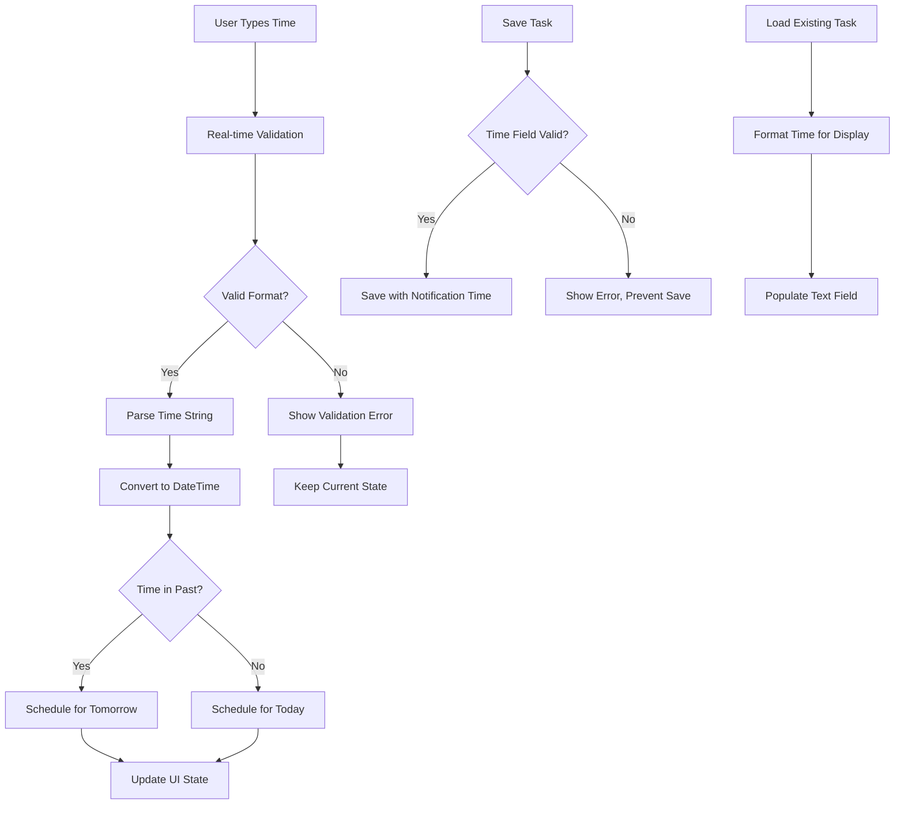

# Manual Time Input for Notifications - Design Document

## Overview

This design document outlines the technical approach to replace the current time picker dialog with a single manual text input field for notification time setting. The implementation will completely remove the time picker dialog and provide only a text-based input method with robust validation and user-friendly formatting.

## Architecture

### Current Implementation Analysis

Based on the existing `lib/widgets/add_task_dialog.dart` implementation, the following components need to be modified:

1. **Remove Time Picker Dialog**: The `_showNotificationTimePicker()` method and its associated `showTimePicker` call must be completely removed
2. **Replace UI Component**: The current `GestureDetector` that opens the time picker needs to be replaced with a `CustomTextField`
3. **Add Time Validation**: New validation logic for parsing and validating manually entered time strings
4. **Update State Management**: Modify how notification time is stored and displayed in the text field

### New Architecture Design



## Components and Interfaces

### 1. Time Input Validation Utility

Create a new utility class for handling time input validation and parsing:

```dart
class TimeInputValidator {
  static const String timeFormatHint = 'Enter time (e.g., 2:30 PM or 14:30)';
  
  // Regex patterns for different time formats
  static final RegExp _24hourPattern = RegExp(r'^([01]?[0-9]|2[0-3]):([0-5][0-9])$');
  static final RegExp _12hourPattern = RegExp(r'^(1[0-2]|0?[1-9]):([0-5][0-9])\s*(AM|PM|am|pm)$');
  
  /// Validates and parses time input string
  static TimeValidationResult validateTimeInput(String input) {
    if (input.trim().isEmpty) {
      return TimeValidationResult.empty();
    }
    
    final trimmedInput = input.trim();
    
    // Try 24-hour format first
    final match24 = _24hourPattern.firstMatch(trimmedInput);
    if (match24 != null) {
      final hour = int.parse(match24.group(1)!);
      final minute = int.parse(match24.group(2)!);
      return TimeValidationResult.success(hour, minute);
    }
    
    // Try 12-hour format
    final match12 = _12hourPattern.firstMatch(trimmedInput);
    if (match12 != null) {
      int hour = int.parse(match12.group(1)!);
      final minute = int.parse(match12.group(2)!);
      final period = match12.group(3)!.toUpperCase();
      
      if (period == 'PM' && hour != 12) {
        hour += 12;
      } else if (period == 'AM' && hour == 12) {
        hour = 0;
      }
      
      return TimeValidationResult.success(hour, minute);
    }
    
    // Invalid format
    return TimeValidationResult.error(_getFormatErrorMessage(trimmedInput));
  }
  
  /// Convert DateTime to display format
  static String formatTimeForDisplay(DateTime dateTime) {
    final hour = dateTime.hour;
    final minute = dateTime.minute;
    
    if (hour == 0) {
      return '12:${minute.toString().padLeft(2, '0')} AM';
    } else if (hour < 12) {
      return '$hour:${minute.toString().padLeft(2, '0')} AM';
    } else if (hour == 12) {
      return '12:${minute.toString().padLeft(2, '0')} PM';
    } else {
      return '${hour - 12}:${minute.toString().padLeft(2, '0')} PM';
    }
  }
  
  /// Create DateTime from validated time input
  static DateTime createNotificationDateTime(int hour, int minute) {
    final now = DateTime.now();
    final scheduledTime = DateTime(now.year, now.month, now.day, hour, minute);
    
    // If time is in the past, schedule for tomorrow
    if (scheduledTime.isBefore(now)) {
      return scheduledTime.add(const Duration(days: 1));
    }
    
    return scheduledTime;
  }
  
  static String _getFormatErrorMessage(String input) {
    if (input.contains(':')) {
      if (input.split(':').length != 2) {
        return 'Use format HH:MM (e.g., 14:30 or 2:30 PM)';
      }
      
      final parts = input.split(':');
      final hourPart = parts[0].trim();
      final minutePart = parts[1].trim().split(' ')[0]; // Remove AM/PM for validation
      
      if (!RegExp(r'^\d+$').hasMatch(hourPart)) {
        return 'Hour must be a number';
      }
      
      if (!RegExp(r'^\d+$').hasMatch(minutePart)) {
        return 'Minute must be a number';
      }
      
      final hour = int.tryParse(hourPart);
      final minute = int.tryParse(minutePart);
      
      if (hour == null || hour < 0 || hour > 23) {
        return 'Hour must be between 0-23 (or 1-12 with AM/PM)';
      }
      
      if (minute == null || minute < 0 || minute > 59) {
        return 'Minute must be between 0-59';
      }
      
      return 'Invalid time format. Use HH:MM or H:MM AM/PM';
    }
    
    return 'Use format HH:MM (e.g., 14:30 or 2:30 PM)';
  }
}

class TimeValidationResult {
  final bool isValid;
  final bool isEmpty;
  final int? hour;
  final int? minute;
  final String? errorMessage;
  
  const TimeValidationResult._({
    required this.isValid,
    required this.isEmpty,
    this.hour,
    this.minute,
    this.errorMessage,
  });
  
  factory TimeValidationResult.success(int hour, int minute) {
    return TimeValidationResult._(
      isValid: true,
      isEmpty: false,
      hour: hour,
      minute: minute,
    );
  }
  
  factory TimeValidationResult.error(String message) {
    return TimeValidationResult._(
      isValid: false,
      isEmpty: false,
      errorMessage: message,
    );
  }
  
  factory TimeValidationResult.empty() {
    return const TimeValidationResult._(
      isValid: true,
      isEmpty: true,
    );
  }
  
  DateTime? toDateTime() {
    if (isValid && !isEmpty && hour != null && minute != null) {
      return TimeInputValidator.createNotificationDateTime(hour!, minute!);
    }
    return null;
  }
}
```

### 2. Enhanced CustomTextField for Time Input

Extend the existing `CustomTextField` to support time input with real-time validation:

```dart
class TimeInputField extends StatefulWidget {
  final TextEditingController controller;
  final String labelText;
  final String hintText;
  final Function(TimeValidationResult)? onTimeChanged;
  final TimeValidationResult? initialValidationResult;
  
  const TimeInputField({
    super.key,
    required this.controller,
    required this.labelText,
    required this.hintText,
    this.onTimeChanged,
    this.initialValidationResult,
  });
  
  @override
  State<TimeInputField> createState() => _TimeInputFieldState();
}

class _TimeInputFieldState extends State<TimeInputField> {
  TimeValidationResult? _currentValidation;
  
  @override
  void initState() {
    super.initState();
    _currentValidation = widget.initialValidationResult;
    widget.controller.addListener(_onTextChanged);
  }
  
  @override
  void dispose() {
    widget.controller.removeListener(_onTextChanged);
    super.dispose();
  }
  
  void _onTextChanged() {
    final validation = TimeInputValidator.validateTimeInput(widget.controller.text);
    setState(() {
      _currentValidation = validation;
    });
    widget.onTimeChanged?.call(validation);
  }
  
  @override
  Widget build(BuildContext context) {
    return CustomTextField(
      controller: widget.controller,
      labelText: widget.labelText,
      hintText: widget.hintText,
      keyboardType: TextInputType.text,
      textInputAction: TextInputAction.done,
      validator: (_) => _currentValidation?.errorMessage,
      suffixIcon: widget.controller.text.isNotEmpty
          ? IconButton(
              icon: const Icon(Icons.clear, size: 20),
              onPressed: () {
                widget.controller.clear();
              },
            )
          : const Icon(Icons.schedule, size: 20),
      helperText: _getHelperText(),
      helperStyle: TextStyle(
        color: _getHelperTextColor(),
        fontSize: 12,
      ),
    );
  }
  
  String _getHelperText() {
    if (_currentValidation == null || _currentValidation!.isEmpty) {
      return TimeInputValidator.timeFormatHint;
    }
    
    if (_currentValidation!.isValid && !_currentValidation!.isEmpty) {
      final dateTime = _currentValidation!.toDateTime();
      if (dateTime != null) {
        final formattedTime = TimeInputValidator.formatTimeForDisplay(dateTime);
        final isNextDay = dateTime.day != DateTime.now().day;
        return isNextDay 
            ? 'Reminder set for tomorrow at $formattedTime'
            : 'Reminder set for today at $formattedTime';
      }
    }
    
    return TimeInputValidator.timeFormatHint;
  }
  
  Color _getHelperTextColor() {
    if (_currentValidation == null || _currentValidation!.isEmpty) {
      return AppTheme.secondaryText;
    }
    
    if (_currentValidation!.isValid) {
      return AppTheme.greyPrimary;
    }
    
    return Colors.red;
  }
}
```

### 3. Updated AddTaskDialog Implementation

The main changes to the `AddTaskDialog` class:

```dart
class _AddTaskDialogState extends ConsumerState<AddTaskDialog> {
  // ... existing fields ...
  
  // Replace _notificationTimeController with time input specific controller
  final _notificationTimeInputController = TextEditingController();
  TimeValidationResult? _timeValidationResult;
  
  @override
  void initState() {
    super.initState();
    _initializeDialog();
  }
  
  void _initializeDialog() {
    if (widget.task != null) {
      // ... existing initialization ...
      
      // Initialize notification time input field
      if (widget.task!.notificationTime != null) {
        _notificationTime = widget.task!.notificationTime!;
        _notificationTimeInputController.text = TimeInputValidator.formatTimeForDisplay(_notificationTime!);
        _timeValidationResult = TimeValidationResult.success(
          _notificationTime!.hour,
          _notificationTime!.minute,
        );
      }
    } else {
      // ... existing initialization ...
    }
  }
  
  @override
  void dispose() {
    // ... existing dispose ...
    _notificationTimeInputController.dispose();
    super.dispose();
  }
  
  // Remove _showNotificationTimePicker method completely
  
  void _onTimeInputChanged(TimeValidationResult validation) {
    setState(() {
      _timeValidationResult = validation;
      if (validation.isValid) {
        _notificationTime = validation.toDateTime();
      } else if (validation.isEmpty) {
        _notificationTime = null;
      }
      // Don't update _notificationTime for invalid input - keep previous valid value
    });
  }
  
  String? _validateForm() {
    // Add time validation to form validation
    if (!_isRoutine && _timeValidationResult != null && !_timeValidationResult!.isValid && !_timeValidationResult!.isEmpty) {
      return _timeValidationResult!.errorMessage;
    }
    return null;
  }
  
  // ... rest of existing methods ...
}
```

### 4. UI Component Replacement

Replace the current time picker UI with the new text input field:

```dart
// Replace the existing notification time section with:
if (!_isRoutine) ...[
  const SizedBox(height: AppTheme.spacingM),
  
  // Priority Dropdown (existing code remains the same)
  // ... existing priority dropdown code ...
  
  const SizedBox(height: AppTheme.spacingM),
  
  // Manual Time Input Field (replaces the GestureDetector)
  TimeInputField(
    controller: _notificationTimeInputController,
    labelText: 'Notification Time',
    hintText: TimeInputValidator.timeFormatHint,
    onTimeChanged: _onTimeInputChanged,
    initialValidationResult: _timeValidationResult,
  ),
],
```

## Data Models

### Time Validation Models

The `TimeValidationResult` class (defined above) serves as the main data model for handling time input validation states.

### Integration with Existing Models

No changes needed to existing `Task` model - the `notificationTime` field remains a `DateTime?` as before.

## Error Handling Strategy

### 1. Real-time Validation

```dart
void _onTextChanged() {
  final validation = TimeInputValidator.validateTimeInput(widget.controller.text);
  
  // Update UI immediately with validation result
  setState(() {
    _currentValidation = validation;
  });
  
  // Notify parent component
  widget.onTimeChanged?.call(validation);
}
```

### 2. Form Submission Validation

```dart
Future<void> _saveTask() async {
  // Check time validation before proceeding
  final timeError = _validateForm();
  if (timeError != null) {
    setState(() {
      _errorMessage = timeError;
    });
    return;
  }
  
  // ... rest of save logic ...
}
```

### 3. User Feedback

- **Real-time feedback**: Helper text shows validation status as user types
- **Visual indicators**: Color-coded helper text (grey for hint, green for valid, red for error)
- **Clear button**: Easy way to clear invalid input
- **Specific error messages**: Detailed feedback about what's wrong with the input

## Testing Strategy

### 1. Unit Tests for Time Validation

```dart
group('TimeInputValidator Tests', () {
  test('should parse 24-hour format correctly', () {
    final result = TimeInputValidator.validateTimeInput('14:30');
    expect(result.isValid, isTrue);
    expect(result.hour, equals(14));
    expect(result.minute, equals(30));
  });
  
  test('should parse 12-hour format correctly', () {
    final result = TimeInputValidator.validateTimeInput('2:30 PM');
    expect(result.isValid, isTrue);
    expect(result.hour, equals(14));
    expect(result.minute, equals(30));
  });
  
  test('should handle invalid format', () {
    final result = TimeInputValidator.validateTimeInput('25:70');
    expect(result.isValid, isFalse);
    expect(result.errorMessage, isNotNull);
  });
  
  test('should handle empty input', () {
    final result = TimeInputValidator.validateTimeInput('');
    expect(result.isEmpty, isTrue);
    expect(result.isValid, isTrue);
  });
});
```

### 2. Widget Tests for Time Input Field

```dart
group('TimeInputField Widget Tests', () {
  testWidgets('should show validation error for invalid input', (WidgetTester tester) async {
    final controller = TextEditingController();
    
    await tester.pumpWidget(MaterialApp(
      home: Scaffold(
        body: TimeInputField(
          controller: controller,
          labelText: 'Test',
          hintText: 'Test hint',
        ),
      ),
    ));
    
    await tester.enterText(find.byType(TextField), '25:70');
    await tester.pump();
    
    expect(find.text('Hour must be between 0-23 (or 1-12 with AM/PM)'), findsOneWidget);
  });
  
  testWidgets('should show success message for valid input', (WidgetTester tester) async {
    final controller = TextEditingController();
    
    await tester.pumpWidget(MaterialApp(
      home: Scaffold(
        body: TimeInputField(
          controller: controller,
          labelText: 'Test',
          hintText: 'Test hint',
        ),
      ),
    ));
    
    await tester.enterText(find.byType(TextField), '14:30');
    await tester.pump();
    
    expect(find.textContaining('Reminder set for'), findsOneWidget);
  });
});
```

### 3. Integration Tests

```dart
group('AddTaskDialog Time Input Integration', () {
  testWidgets('should save task with manually entered time', (WidgetTester tester) async {
    // Test complete flow from time input to task saving
    await tester.pumpWidget(createTestApp());
    
    // Open add task dialog
    await tester.tap(find.byIcon(Icons.add));
    await tester.pumpAndSettle();
    
    // Enter task title
    await tester.enterText(find.byType(TextField).first, 'Test Task');
    
    // Enter notification time
    await tester.enterText(find.byType(TimeInputField), '2:30 PM');
    await tester.pump();
    
    // Save task
    await tester.tap(find.text('Add Task'));
    await tester.pumpAndSettle();
    
    // Verify task was saved with correct time
    // ... verification logic ...
  });
});
```

## Implementation Details

### 1. Remove Time Picker Components

**Files to modify**:
- `lib/widgets/add_task_dialog.dart`: Remove `_showNotificationTimePicker()` method and related UI

**Specific removals**:
```dart
// REMOVE this entire method:
Future<void> _showNotificationTimePicker() async {
  // ... entire method implementation
}

// REMOVE the GestureDetector wrapper and replace with TimeInputField
```

### 2. Add Time Validation Utility

**New file**: `lib/utils/time_input_validator.dart`
- Implement the `TimeInputValidator` class as designed above
- Add comprehensive validation for both 24-hour and 12-hour formats
- Handle edge cases and provide clear error messages

### 3. Create Time Input Field Widget

**New file**: `lib/widgets/time_input_field.dart`
- Implement the `TimeInputField` widget as designed above
- Integrate with existing `CustomTextField` for consistent styling
- Add real-time validation and user feedback

### 4. Update AddTaskDialog

**Modify**: `lib/widgets/add_task_dialog.dart`
- Replace time picker UI with `TimeInputField`
- Update state management for manual time input
- Add form validation for time input
- Update initialization and disposal methods

## Performance Considerations

### 1. Real-time Validation Optimization
- Debounce validation to avoid excessive processing during fast typing
- Cache validation results to avoid re-parsing identical input
- Use efficient regex patterns for time format matching

### 2. Memory Management
- Properly dispose of additional text controllers
- Remove listeners to prevent memory leaks
- Clear validation state when component is disposed

## User Experience Enhancements

### 1. Input Assistance
- Show format examples in placeholder text
- Provide real-time feedback on input validity
- Auto-format display for consistency

### 2. Error Recovery
- Clear, specific error messages
- Easy way to clear invalid input
- Helpful suggestions for correct format

### 3. Accessibility
- Proper semantic labels for screen readers
- Keyboard navigation support
- High contrast validation indicators

This design provides a comprehensive solution to replace the time picker dialog with a user-friendly manual text input system while maintaining robust validation and excellent user experience.