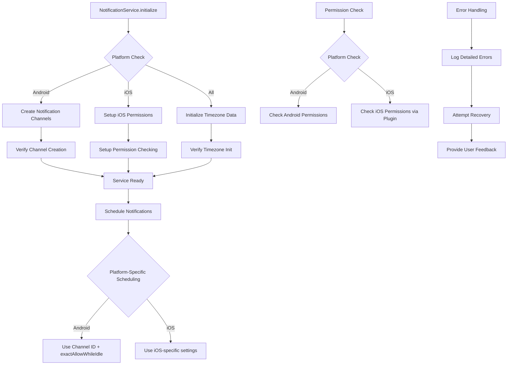

# Notification System Fixes - Design Document

## Overview

This design document outlines the technical approach to fix critical notification system issues in the task manager app. The current implementation has several problems that cause notifications to fail silently or not work properly on different platforms. The fixes will address Android notification channel requirements, iOS permission checking accuracy, timezone handling, and overall system robustness.

## Architecture

### Current Issues Analysis

Based on the existing `lib/services/notification_service.dart` implementation, the following critical issues have been identified:

1. **Missing Android Notification Channels**: The current implementation defines notification channel details in `_getNotificationDetails()` but doesn't actually create the notification channel during initialization. Android 8.0+ requires channels to be created before notifications can be scheduled.

2. **Inaccurate iOS Permission Checking**: The `areNotificationsEnabled()` method returns hardcoded `true` for iOS, which doesn't reflect the actual device permission status.

3. **Timezone Initialization Risks**: While timezone is initialized, there's no error handling or verification that the initialization was successful.

4. **Limited Error Handling**: Current error handling is minimal with only debug prints, making it difficult to diagnose issues in production.

### Fixed Architecture Design



## Components and Interfaces

### 1. Enhanced NotificationService

The main service class will be enhanced with proper platform-specific initialization and error handling.

**Key Enhancements**:
- Android notification channel creation and management
- Accurate iOS permission checking
- Robust timezone initialization with error handling
- Comprehensive error logging and recovery
- Self-healing capabilities for common issues

**Enhanced Interface**:
```dart
class NotificationService {
  static final NotificationService _instance = NotificationService._internal();
  factory NotificationService() => _instance;
  NotificationService._internal();

  late FlutterLocalNotificationsPlugin _flutterLocalNotificationsPlugin;
  bool _isInitialized = false;
  bool _channelsCreated = false;
  bool _timezoneInitialized = false;
  final Random _random = Random();
  
  // Enhanced initialization with platform-specific setup
  Future<void> initialize() async { /* Enhanced implementation */ }
  
  // Android-specific channel management
  Future<void> _createAndroidNotificationChannels() async { /* Implementation */ }
  Future<bool> _verifyNotificationChannels() async { /* Implementation */ }
  Future<void> _recreateChannelsIfNeeded() async { /* Implementation */ }
  
  // Enhanced timezone initialization
  Future<void> _initializeTimezoneData() async { /* Implementation */ }
  Future<bool> _verifyTimezoneInitialization() async { /* Implementation */ }
  
  // Accurate permission checking
  Future<bool> areNotificationsEnabled() async { /* Enhanced implementation */ }
  Future<NotificationPermissionStatus> getDetailedPermissionStatus() async { /* Implementation */ }
  
  // Enhanced scheduling with error handling
  Future<int?> scheduleTaskNotification(Task task) async { /* Enhanced implementation */ }
  
  // Self-healing and recovery methods
  Future<void> performHealthCheck() async { /* Implementation */ }
  Future<void> attemptServiceRecovery() async { /* Implementation */ }
  
  // Testing and verification
  Future<bool> sendTestNotification() async { /* Implementation */ }
  Future<NotificationServiceStatus> getServiceStatus() async { /* Implementation */ }
  
  // Enhanced error handling
  void _logError(String operation, dynamic error, StackTrace? stackTrace) { /* Implementation */ }
  Future<void> _handleInitializationError(String component, dynamic error) async { /* Implementation */ }
}
```

### 2. Platform-Specific Channel Management

**Android Notification Channels**:
```dart
class AndroidNotificationChannels {
  static const String taskRemindersChannelId = 'task_reminders';
  static const String achievementsChannelId = 'achievements';
  static const String systemChannelId = 'system_notifications';
  
  static const AndroidNotificationChannel taskRemindersChannel = AndroidNotificationChannel(
    taskRemindersChannelId,
    'Task Reminders',
    description: 'Notifications for scheduled task reminders',
    importance: Importance.high,
    enableVibration: true,
    playSound: true,
    showBadge: true,
  );
  
  static const AndroidNotificationChannel achievementsChannel = AndroidNotificationChannel(
    achievementsChannelId,
    'Achievements',
    description: 'Notifications for earned achievements and milestones',
    importance: Importance.defaultImportance,
    enableVibration: true,
    playSound: true,
    showBadge: false,
  );
  
  static const AndroidNotificationChannel systemChannel = AndroidNotificationChannel(
    systemChannelId,
    'System Notifications',
    description: 'System notifications and app updates',
    importance: Importance.low,
    enableVibration: false,
    playSound: false,
    showBadge: false,
  );
  
  static List<AndroidNotificationChannel> getAllChannels() {
    return [taskRemindersChannel, achievementsChannel, systemChannel];
  }
}
```

### 3. Enhanced Permission Management

**Permission Status Enum**:
```dart
enum NotificationPermissionStatus {
  granted,
  denied,
  notDetermined,
  provisional, // iOS-specific
  restricted,  // iOS-specific
  unknown,
}

class NotificationPermissionManager {
  static Future<NotificationPermissionStatus> checkPermissionStatus() async { /* Implementation */ }
  static Future<bool> requestPermissions() async { /* Implementation */ }
  static Future<void> openAppSettings() async { /* Implementation */ }
  static String getPermissionStatusDescription(NotificationPermissionStatus status) { /* Implementation */ }
}
```

### 4. Timezone Management

**Enhanced Timezone Handling**:
```dart
class TimezoneManager {
  static bool _isInitialized = false;
  static String? _initializationError;
  
  static Future<bool> initializeTimezones() async {
    try {
      tz.initializeTimeZones();
      _isInitialized = true;
      _initializationError = null;
      return true;
    } catch (e, stackTrace) {
      _initializationError = e.toString();
      _logTimezoneError('Timezone initialization failed', e, stackTrace);
      return false;
    }
  }
  
  static bool get isInitialized => _isInitialized;
  static String? get initializationError => _initializationError;
  
  static tz.TZDateTime? safeConvertToTZDateTime(DateTime dateTime) {
    if (!_isInitialized) {
      return null;
    }
    
    try {
      final tz.Location local = tz.local;
      return tz.TZDateTime.from(dateTime, local);
    } catch (e) {
      _logTimezoneError('DateTime conversion failed', e, null);
      return null;
    }
  }
  
  static void _logTimezoneError(String message, dynamic error, StackTrace? stackTrace) {
    debugPrint('TimezoneManager Error: $message - $error');
    if (stackTrace != null) {
      debugPrint('Stack trace: $stackTrace');
    }
  }
}
```

### 5. Service Health Monitoring

**Service Status Tracking**:
```dart
class NotificationServiceStatus {
  final bool isInitialized;
  final bool channelsCreated;
  final bool timezoneInitialized;
  final bool permissionsGranted;
  final List<String> errors;
  final List<String> warnings;
  final DateTime lastHealthCheck;
  
  NotificationServiceStatus({
    required this.isInitialized,
    required this.channelsCreated,
    required this.timezoneInitialized,
    required this.permissionsGranted,
    required this.errors,
    required this.warnings,
    required this.lastHealthCheck,
  });
  
  bool get isHealthy => isInitialized && channelsCreated && timezoneInitialized && errors.isEmpty;
  
  Map<String, dynamic> toJson() { /* Implementation */ }
  String getStatusSummary() { /* Implementation */ }
}
```

## Data Models

### Enhanced Error Handling Models

```dart
class NotificationError {
  final String operation;
  final String platform;
  final String errorType;
  final String message;
  final DateTime timestamp;
  final Map<String, dynamic>? context;
  
  NotificationError({
    required this.operation,
    required this.platform,
    required this.errorType,
    required this.message,
    required this.timestamp,
    this.context,
  });
  
  Map<String, dynamic> toJson() { /* Implementation */ }
  String getFormattedError() { /* Implementation */ }
}

class NotificationRecoveryAction {
  final String actionType;
  final String description;
  final Future<bool> Function() action;
  final int maxRetries;
  
  NotificationRecoveryAction({
    required this.actionType,
    required this.description,
    required this.action,
    this.maxRetries = 3,
  });
}
```

## Error Handling Strategy

### 1. Initialization Error Handling

```dart
Future<void> _handleInitializationError(String component, dynamic error) async {
  final notificationError = NotificationError(
    operation: 'initialization',
    platform: Platform.operatingSystem,
    errorType: error.runtimeType.toString(),
    message: error.toString(),
    timestamp: DateTime.now(),
    context: {'component': component},
  );
  
  _logError('Initialization failed for $component', error, StackTrace.current);
  
  // Attempt recovery based on component
  switch (component) {
    case 'channels':
      await _attemptChannelRecovery();
      break;
    case 'timezone':
      await _attemptTimezoneRecovery();
      break;
    case 'permissions':
      await _attemptPermissionRecovery();
      break;
  }
}
```

### 2. Runtime Error Recovery

```dart
Future<void> _attemptChannelRecovery() async {
  try {
    // Wait a bit and retry channel creation
    await Future.delayed(const Duration(seconds: 1));
    await _createAndroidNotificationChannels();
    
    if (await _verifyNotificationChannels()) {
      _channelsCreated = true;
      debugPrint('Channel recovery successful');
    } else {
      debugPrint('Channel recovery failed - channels still not available');
    }
  } catch (e) {
    debugPrint('Channel recovery attempt failed: $e');
  }
}

Future<void> _attemptTimezoneRecovery() async {
  try {
    // Retry timezone initialization with different approach
    await Future.delayed(const Duration(milliseconds: 500));
    
    if (await TimezoneManager.initializeTimezones()) {
      _timezoneInitialized = true;
      debugPrint('Timezone recovery successful');
    } else {
      debugPrint('Timezone recovery failed');
    }
  } catch (e) {
    debugPrint('Timezone recovery attempt failed: $e');
  }
}
```

## Testing Strategy

### 1. Unit Testing Enhancements

```dart
// Test notification channel creation
testWidgets('should create Android notification channels', (WidgetTester tester) async {
  final service = NotificationService();
  await service.initialize();
  
  final status = await service.getServiceStatus();
  expect(status.channelsCreated, isTrue);
});

// Test iOS permission checking accuracy
testWidgets('should accurately check iOS permissions', (WidgetTester tester) async {
  final service = NotificationService();
  await service.initialize();
  
  final permissionStatus = await service.getDetailedPermissionStatus();
  expect(permissionStatus, isNot(NotificationPermissionStatus.unknown));
});

// Test timezone initialization
testWidgets('should initialize timezone data successfully', (WidgetTester tester) async {
  final service = NotificationService();
  await service.initialize();
  
  expect(TimezoneManager.isInitialized, isTrue);
  expect(TimezoneManager.initializationError, isNull);
});
```

### 2. Integration Testing

```dart
// Test complete notification flow
testWidgets('should schedule and verify notification', (WidgetTester tester) async {
  final service = NotificationService();
  await service.initialize();
  
  final task = Task(
    title: 'Test Task',
    notificationTime: DateTime.now().add(const Duration(minutes: 1)),
    createdAt: DateTime.now(),
  );
  
  final notificationId = await service.scheduleTaskNotification(task);
  expect(notificationId, isNotNull);
  
  final isScheduled = await service.isNotificationScheduled(notificationId!);
  expect(isScheduled, isTrue);
});

// Test service recovery
testWidgets('should recover from initialization failures', (WidgetTester tester) async {
  final service = NotificationService();
  
  // Simulate initialization failure and recovery
  await service.attemptServiceRecovery();
  
  final status = await service.getServiceStatus();
  expect(status.isHealthy, isTrue);
});
```

### 3. Platform-Specific Testing

```dart
// Android-specific tests
group('Android Notification Tests', () {
  testWidgets('should create notification channels on Android', (WidgetTester tester) async {
    // Test Android channel creation
  });
  
  testWidgets('should handle Android permission requests', (WidgetTester tester) async {
    // Test Android permission flow
  });
});

// iOS-specific tests
group('iOS Notification Tests', () {
  testWidgets('should accurately check iOS permissions', (WidgetTester tester) async {
    // Test iOS permission checking
  });
  
  testWidgets('should handle iOS notification scheduling', (WidgetTester tester) async {
    // Test iOS notification flow
  });
});
```

## Implementation Details

### 1. Android Notification Channel Creation

```dart
Future<void> _createAndroidNotificationChannels() async {
  if (!Platform.isAndroid) return;
  
  try {
    final AndroidFlutterLocalNotificationsPlugin? androidImplementation =
        _flutterLocalNotificationsPlugin.resolvePlatformSpecificImplementation<
            AndroidFlutterLocalNotificationsPlugin>();
    
    if (androidImplementation == null) {
      throw Exception('Android implementation not available');
    }
    
    // Create all notification channels
    for (final channel in AndroidNotificationChannels.getAllChannels()) {
      await androidImplementation.createNotificationChannel(channel);
      debugPrint('Created notification channel: ${channel.id}');
    }
    
    _channelsCreated = true;
  } catch (e, stackTrace) {
    _logError('Channel creation failed', e, stackTrace);
    await _handleInitializationError('channels', e);
  }
}
```

### 2. Enhanced iOS Permission Checking

```dart
Future<bool> areNotificationsEnabled() async {
  if (!_isInitialized) {
    await initialize();
  }

  if (Platform.isAndroid) {
    final AndroidFlutterLocalNotificationsPlugin? androidImplementation =
        _flutterLocalNotificationsPlugin.resolvePlatformSpecificImplementation<
            AndroidFlutterLocalNotificationsPlugin>();
    return await androidImplementation?.areNotificationsEnabled() ?? false;
  } else if (Platform.isIOS) {
    // Use the plugin to get actual iOS permission status
    final IOSFlutterLocalNotificationsPlugin? iosImplementation =
        _flutterLocalNotificationsPlugin.resolvePlatformSpecificImplementation<
            IOSFlutterLocalNotificationsPlugin>();
    
    if (iosImplementation == null) {
      return false;
    }
    
    try {
      // Check if we can get notification settings
      final bool? result = await iosImplementation.checkPermissions();
      return result ?? false;
    } catch (e) {
      _logError('iOS permission check failed', e, null);
      return false;
    }
  }

  return false;
}
```

### 3. Enhanced Scheduling with Error Handling

```dart
Future<int?> scheduleTaskNotification(Task task) async {
  if (!_isInitialized) {
    await initialize();
  }

  // Perform health check before scheduling
  await performHealthCheck();
  
  if (task.notificationTime == null || task.isCompleted) {
    return null;
  }

  if (task.notificationTime!.isBefore(DateTime.now())) {
    return null;
  }

  final int notificationId = task.notificationId ?? _generateNotificationId();

  try {
    // Enhanced timezone conversion with error handling
    final tz.TZDateTime? scheduledDate = TimezoneManager.safeConvertToTZDateTime(task.notificationTime!);
    
    if (scheduledDate == null) {
      _logError('Timezone conversion failed', 'Unable to convert DateTime to TZDateTime', null);
      return null;
    }

    await _flutterLocalNotificationsPlugin.zonedSchedule(
      notificationId,
      'Task Reminder',
      _formatNotificationBody(task),
      scheduledDate,
      _getNotificationDetails(),
      androidScheduleMode: AndroidScheduleMode.exactAllowWhileIdle,
      uiLocalNotificationDateInterpretation: UILocalNotificationDateInterpretation.absoluteTime,
      payload: task.id?.toString(),
    );

    // Verify the notification was scheduled
    final isScheduled = await isNotificationScheduled(notificationId);
    if (!isScheduled) {
      _logError('Notification scheduling verification failed', 'Notification not found in pending list', null);
      return null;
    }

    return notificationId;
  } catch (e, stackTrace) {
    _logError('Notification scheduling failed', e, stackTrace);
    return null;
  }
}
```

### 4. Service Health Monitoring

```dart
Future<void> performHealthCheck() async {
  final List<String> errors = [];
  final List<String> warnings = [];
  
  // Check initialization status
  if (!_isInitialized) {
    errors.add('Service not initialized');
  }
  
  // Check Android channels (if on Android)
  if (Platform.isAndroid && !_channelsCreated) {
    errors.add('Android notification channels not created');
    await _attemptChannelRecovery();
  }
  
  // Check timezone initialization
  if (!TimezoneManager.isInitialized) {
    errors.add('Timezone data not initialized');
    await _attemptTimezoneRecovery();
  }
  
  // Check permissions
  final permissionsEnabled = await areNotificationsEnabled();
  if (!permissionsEnabled) {
    warnings.add('Notification permissions not granted');
  }
  
  // Log health check results
  if (errors.isNotEmpty) {
    debugPrint('NotificationService health check failed: ${errors.join(', ')}');
  }
  
  if (warnings.isNotEmpty) {
    debugPrint('NotificationService health check warnings: ${warnings.join(', ')}');
  }
}
```

## Performance Considerations

### 1. Lazy Initialization
- Initialize components only when needed
- Cache initialization status to avoid repeated checks
- Use singleton pattern to prevent multiple service instances

### 2. Efficient Error Handling
- Implement exponential backoff for retry operations
- Limit the number of recovery attempts to prevent infinite loops
- Use structured logging for better debugging

### 3. Memory Management
- Properly dispose of notification listeners
- Clear cached data when appropriate
- Avoid memory leaks in long-running operations

## Security Considerations

### 1. Permission Handling
- Always check permissions before attempting operations
- Provide clear user guidance when permissions are denied
- Handle permission state changes gracefully

### 2. Data Protection
- Don't log sensitive task information in error messages
- Sanitize notification content to prevent information leakage
- Use secure storage for notification preferences

## Deployment Strategy

### 1. Gradual Rollout
- Implement fixes incrementally to isolate issues
- Test each fix thoroughly before moving to the next
- Maintain backward compatibility during transition

### 2. Monitoring and Logging
- Implement comprehensive logging for production debugging
- Monitor notification delivery rates and failure patterns
- Set up alerts for critical notification system failures

This design provides a comprehensive solution to fix the identified notification system issues while maintaining robustness and providing better user experience across all supported platforms.