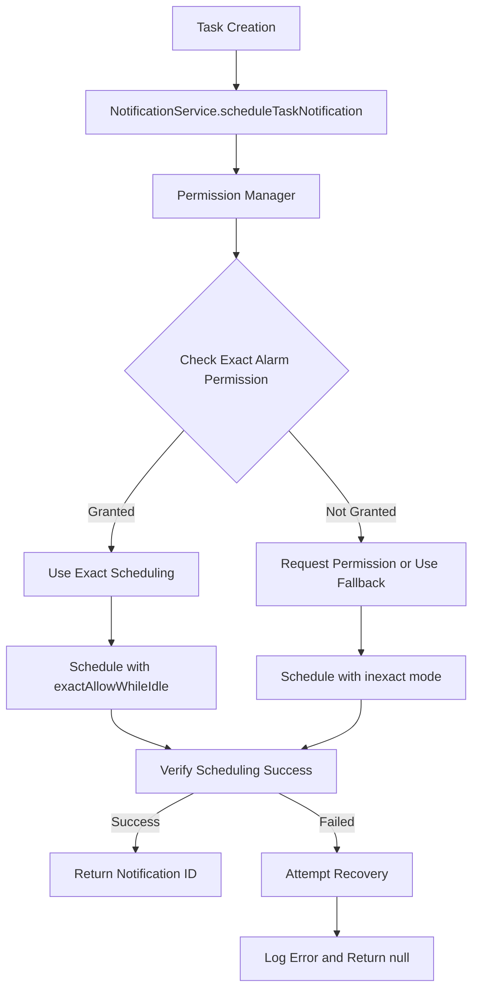

# Design Document

## Overview

The notification scheduling issue stems from Android's evolving permission model for exact alarms, introduced in Android 12 (API 31). The current implementation attempts to use `AndroidScheduleMode.exactAllowWhileIdle` without properly checking or requesting the required `SCHEDULE_EXACT_ALARM` permission. This design addresses the issue through improved permission handling, fallback mechanisms, and enhanced error reporting.

## Architecture

### Core Components

1. **Enhanced Permission Manager**: Handles Android exact alarm permissions
2. **Scheduling Strategy Pattern**: Implements multiple scheduling approaches with fallbacks
3. **Notification Verification System**: Ensures scheduled notifications are actually created
4. **Diagnostic and Recovery System**: Provides comprehensive error handling and recovery

### Component Interactions



## Components and Interfaces

### Enhanced Permission Manager

```dart
class AndroidPermissionManager {
  /// Check if exact alarm permission is granted
  static Future<bool> hasExactAlarmPermission() async;
  
  /// Request exact alarm permission (opens system settings)
  static Future<bool> requestExactAlarmPermission() async;
  
  /// Check if device supports exact alarms
  static Future<bool> supportsExactAlarms() async;
  
  /// Get detailed permission status
  static Future<ExactAlarmPermissionStatus> getPermissionStatus() async;
}

enum ExactAlarmPermissionStatus {
  granted,
  denied,
  notSupported,
  unknown
}
```

### Scheduling Strategy Pattern

```dart
abstract class NotificationSchedulingStrategy {
  Future<bool> scheduleNotification(int id, String title, String body, 
      tz.TZDateTime scheduledTime, NotificationDetails details);
  String get strategyName;
  bool get isExact;
}

class ExactAlarmStrategy implements NotificationSchedulingStrategy {
  // Uses AndroidScheduleMode.exactAllowWhileIdle
}

class InexactAlarmStrategy implements NotificationSchedulingStrategy {
  // Uses AndroidScheduleMode.inexact
}

class FallbackStrategy implements NotificationSchedulingStrategy {
  // Uses basic scheduling without specific mode
}
```

### Enhanced NotificationService Methods

```dart
class NotificationService {
  /// Enhanced scheduling with comprehensive error handling
  Future<int?> scheduleTaskNotification(Task task) async {
    // 1. Perform health checks
    // 2. Check and handle permissions
    // 3. Select appropriate scheduling strategy
    // 4. Attempt scheduling with verification
    // 5. Handle errors with recovery attempts
  }
  
  /// Check exact alarm permissions specifically
  Future<bool> checkExactAlarmPermissions() async;
  
  /// Request exact alarm permissions with user guidance
  Future<bool> requestExactAlarmPermissions() async;
  
  /// Get recommended scheduling strategy for current device
  Future<NotificationSchedulingStrategy> getOptimalStrategy() async;
  
  /// Verify notification was actually scheduled
  Future<bool> verifyNotificationScheduled(int notificationId) async;
}
```

## Data Models

### Enhanced Error Tracking

```dart
class NotificationSchedulingError extends NotificationError {
  final AndroidScheduleMode attemptedMode;
  final ExactAlarmPermissionStatus permissionStatus;
  final List<String> recoveryAttempts;
  final bool fallbackUsed;
  
  NotificationSchedulingError({
    required super.operation,
    required super.platform,
    required super.errorType,
    required super.message,
    required super.timestamp,
    required this.attemptedMode,
    required this.permissionStatus,
    required this.recoveryAttempts,
    required this.fallbackUsed,
    super.context,
  });
}
```

### Scheduling Result

```dart
class NotificationSchedulingResult {
  final int? notificationId;
  final bool success;
  final AndroidScheduleMode? usedMode;
  final String? errorMessage;
  final List<String> warnings;
  final bool usedFallback;
  
  NotificationSchedulingResult({
    this.notificationId,
    required this.success,
    this.usedMode,
    this.errorMessage,
    this.warnings = const [],
    this.usedFallback = false,
  });
}
```

## Error Handling

### Comprehensive Error Recovery Flow

1. **Permission Check Phase**
   - Check exact alarm permission status
   - Request permission if needed and possible
   - Select appropriate scheduling strategy

2. **Scheduling Attempt Phase**
   - Try primary strategy (exact alarms if available)
   - Verify scheduling success
   - Fall back to alternative strategies if needed

3. **Verification Phase**
   - Check if notification appears in pending list
   - Validate scheduling parameters
   - Attempt recovery if verification fails

4. **Recovery Phase**
   - Retry with different scheduling modes
   - Clear and reschedule if needed
   - Log detailed error information

### Error Categories and Responses

| Error Type | Cause | Recovery Action |
|------------|-------|-----------------|
| Permission Denied | Exact alarm permission not granted | Fall back to inexact scheduling |
| Timezone Error | TZDateTime conversion failed | Retry with timezone recovery |
| Scheduling Failed | System rejected scheduling request | Try alternative scheduling mode |
| Verification Failed | Notification not in pending list | Retry scheduling with different parameters |
| Service Unhealthy | Multiple component failures | Full service recovery attempt |

## Testing Strategy

### Unit Tests
- Permission manager functionality
- Scheduling strategy selection
- Error handling and recovery
- Timezone conversion edge cases

### Integration Tests
- End-to-end notification scheduling
- Permission request flows
- Fallback mechanism verification
- Cross-platform compatibility

### Manual Testing
- Test on different Android versions (API 26, 31, 33+)
- Test with and without exact alarm permissions
- Test timezone edge cases
- Test recovery from various error states

## Implementation Approach

### Phase 1: Enhanced Permission Handling
1. Implement AndroidPermissionManager
2. Add exact alarm permission checks
3. Integrate permission checks into scheduling flow

### Phase 2: Scheduling Strategy Pattern
1. Create scheduling strategy interfaces
2. Implement exact, inexact, and fallback strategies
3. Add strategy selection logic

### Phase 3: Verification and Recovery
1. Enhance notification verification
2. Implement comprehensive error recovery
3. Add detailed logging and diagnostics

### Phase 4: User Experience Improvements
1. Add user-friendly error messages
2. Implement permission request guidance
3. Add notification scheduling status indicators

## Platform Considerations

### Android API Level Differences

- **API 26-30**: Basic notification channels, no exact alarm restrictions
- **API 31+**: Exact alarm permission required for `exactAllowWhileIdle`
- **API 33+**: Runtime notification permission required

### Fallback Strategies by Platform

1. **Primary**: `exactAllowWhileIdle` with permission check
2. **Fallback 1**: `inexact` scheduling (less precise timing)
3. **Fallback 2**: Basic `zonedSchedule` without specific mode
4. **Final Fallback**: Immediate notification with user notification about timing

## Security and Privacy

- No sensitive data in notification payloads
- Proper permission request flows
- Clear user communication about permission requirements
- Graceful degradation when permissions are denied

## Performance Considerations

- Lazy initialization of permission checks
- Caching of permission status
- Efficient strategy selection
- Minimal overhead for verification checks

## Monitoring and Diagnostics

### Enhanced Logging
- Detailed permission status logging
- Strategy selection reasoning
- Scheduling attempt outcomes
- Recovery action results

### Health Monitoring
- Regular permission status checks
- Scheduling success rate tracking
- Error pattern analysis
- Performance metrics collection