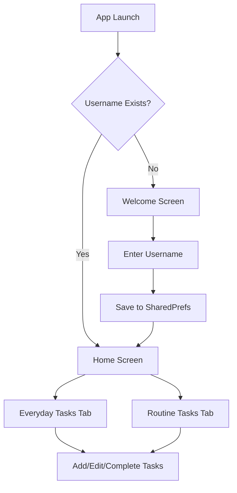

# Task Manager App Design Document

## Overview

This design document outlines the technical architecture and implementation approach for a Flutter-based task manager app with dark theme, personalized user experience, and local data persistence. The app features a welcome screen for user onboarding, a main task management interface with tabbed organization, and comprehensive theme integration.

## Architecture

### High-Level Architecture

The app follows a simple, component-based architecture without complex patterns like MVVM to maintain developer-friendly navigation and code organization.

```
lib/
├── main.dart                 # App entry point and theme configuration
├── screens/                  # Screen components
│   ├── welcome_screen.dart   # User onboarding and name input
│   └── home_screen.dart      # Main task management interface
├── widgets/                  # Reusable UI components
│   ├── custom_app_bar.dart   # Themed AppBar with share functionality
│   ├── task_container.dart   # Task display container with date
│   ├── task_item.dart        # Individual task with checkbox
│   ├── add_task_dialog.dart  # Task creation dialog
│   └── custom_text_field.dart # Themed input field
├── services/                 # Business logic and data services
│   ├── database_service.dart # Drift database operations
│   ├── preferences_service.dart # SharedPreferences wrapper
│   └── share_service.dart    # App sharing functionality
├── models/                   # Data models
│   ├── task.dart            # Task data model
│   ├── user.dart            # User data model
│   └── database.dart        # Drift database schema
└── utils/                   # Utilities and constants
    ├── theme.dart           # Theme configuration
    └── constants.dart       # App constants
```

### Navigation Flow



## Components and Interfaces

### 1. Welcome Screen (`welcome_screen.dart`)

**Purpose**: User onboarding and name collection for personalization

**Key Components**:
- App logo container with app name
- Custom text input field with theme styling
- Forward arrow button for navigation
- SharedPreferences integration for username storage

**Interface**:
```dart
class WelcomeScreen extends StatefulWidget {
  @override
  _WelcomeScreenState createState() => _WelcomeScreenState();
}

class _WelcomeScreenState extends State<WelcomeScreen> {
  final TextEditingController _nameController = TextEditingController();
  final PreferencesService _prefsService = PreferencesService();
  
  Future<void> _saveNameAndNavigate() async { /* Implementation */ }
  Widget _buildLogoContainer() { /* Implementation */ }
  Widget _buildNameInput() { /* Implementation */ }
  Widget _buildNavigationButton() { /* Implementation */ }
}
```

### 2. Home Screen (`home_screen.dart`)

**Purpose**: Main task management interface with tabbed organization

**Key Components**:
- Custom AppBar with app name and share functionality
- Personalized greeting message
- Tab controller for Everyday/Routine tasks
- Task containers with date display
- Floating action button for quick task addition

**Interface**:
```dart
class HomeScreen extends StatefulWidget {
  @override
  _HomeScreenState createState() => _HomeScreenState();
}

class _HomeScreenState extends State<HomeScreen> with TickerProviderStateMixin {
  late TabController _tabController;
  final DatabaseService _dbService = DatabaseService();
  final PreferencesService _prefsService = PreferencesService();
  
  String _userName = '';
  List<Task> _everydayTasks = [];
  List<Task> _routineTasks = [];
  
  Future<void> _loadUserData() async { /* Implementation */ }
  Future<void> _loadTasks() async { /* Implementation */ }
  Widget _buildGreeting() { /* Implementation */ }
  Widget _buildTaskTabs() { /* Implementation */ }
}
```

### 3. Custom AppBar (`custom_app_bar.dart`)

**Purpose**: Consistent navigation bar with theme integration and share functionality

**Key Features**:
- App name display on left side
- Share icon with app sharing functionality
- Theme-consistent styling
- Reusable across screens

**Interface**:
```dart
class CustomAppBar extends StatelessWidget implements PreferredSizeWidget {
  final String title;
  final bool showShareButton;
  
  const CustomAppBar({
    Key? key,
    required this.title,
    this.showShareButton = true,
  }) : super(key: key);
  
  @override
  Widget build(BuildContext context) { /* Implementation */ }
  
  @override
  Size get preferredSize => const Size.fromHeight(kToolbarHeight);
}
```

### 4. Task Container (`task_container.dart`)

**Purpose**: Display tasks for a specific date with add functionality

**Key Features**:
- Rounded rectangular design with white border
- Date display at top
- Plus icon for adding new tasks
- Scrollable task list
- Theme-consistent styling

**Interface**:
```dart
class TaskContainer extends StatelessWidget {
  final DateTime date;
  final List<Task> tasks;
  final VoidCallback onAddTask;
  final Function(Task) onTaskToggle;
  final Function(Task) onTaskEdit;
  final Function(Task) onTaskDelete;
  
  const TaskContainer({
    Key? key,
    required this.date,
    required this.tasks,
    required this.onAddTask,
    required this.onTaskToggle,
    required this.onTaskEdit,
    required this.onTaskDelete,
  }) : super(key: key);
  
  @override
  Widget build(BuildContext context) { /* Implementation */ }
}
```

### 5. Task Item (`task_item.dart`)

**Purpose**: Individual task display with interaction capabilities

**Key Features**:
- Checkbox for completion status
- Task title and description
- Edit and delete functionality
- Visual distinction for routine vs everyday tasks
- Theme-consistent styling

**Interface**:
```dart
class TaskItem extends StatelessWidget {
  final Task task;
  final Function(bool?) onToggle;
  final VoidCallback onEdit;
  final VoidCallback onDelete;
  
  const TaskItem({
    Key? key,
    required this.task,
    required this.onToggle,
    required this.onEdit,
    required this.onDelete,
  }) : super(key: key);
  
  @override
  Widget build(BuildContext context) { /* Implementation */ }
}
```

### 6. Stats Screen (`stats_screen.dart`)

**Purpose**: Display productivity insights, heatmaps, and achievements

**Key Features**:
- Task completion activity heatmap (purple color scheme)
- Task creation vs completion heatmap (green color scheme)
- Achievement system with progress tracking
- Interactive tooltips for heatmap data
- Responsive grid layouts

**Interface**:
```dart
class StatsScreen extends ConsumerWidget {
  const StatsScreen({Key? key}) : super(key: key);
  
  @override
  Widget build(BuildContext context, WidgetRef ref) { /* Implementation */ }
  
  Widget _buildCompletionHeatmap(List<Task> tasks) { /* Implementation */ }
  Widget _buildCreationVsCompletionHeatmap(List<Task> tasks) { /* Implementation */ }
  Widget _buildAchievementsSection(List<Achievement> achievements) { /* Implementation */ }
  Map<DateTime, int> _calculateDailyCompletions(List<Task> tasks) { /* Implementation */ }
  Map<DateTime, Map<String, int>> _calculateDailyCreationCompletion(List<Task> tasks) { /* Implementation */ }
}
```

### 7. Heatmap Widget (`heatmap_widget.dart`)

**Purpose**: Reusable calendar-style heatmap component

**Key Features**:
- Configurable color schemes (purple/green)
- Interactive tooltips
- Monthly organization with year view
- Responsive cell sizing
- Data intensity visualization

**Interface**:
```dart
class HeatmapWidget extends StatelessWidget {
  final Map<DateTime, dynamic> data;
  final Color baseColor;
  final String title;
  final Function(DateTime, dynamic) onCellTap;
  final Widget Function(DateTime, dynamic) tooltipBuilder;
  
  const HeatmapWidget({
    Key? key,
    required this.data,
    required this.baseColor,
    required this.title,
    required this.onCellTap,
    required this.tooltipBuilder,
  }) : super(key: key);
  
  @override
  Widget build(BuildContext context) { /* Implementation */ }
  
  Color _getIntensityColor(dynamic value) { /* Implementation */ }
  Widget _buildMonthGrid(DateTime month) { /* Implementation */ }
  Widget _buildDayCell(DateTime date, dynamic value) { /* Implementation */ }
}
```

### 8. Achievement Widget (`achievement_widget.dart`)

**Purpose**: Display individual achievements with progress

**Key Features**:
- Achievement icon and title
- Progress indicators for unearned achievements
- Visual distinction between earned and unearned
- Achievement descriptions and unlock criteria

**Interface**:
```dart
class AchievementWidget extends StatelessWidget {
  final Achievement achievement;
  final bool isEarned;
  final double progress;
  
  const AchievementWidget({
    Key? key,
    required this.achievement,
    required this.isEarned,
    this.progress = 0.0,
  }) : super(key: key);
  
  @override
  Widget build(BuildContext context) { /* Implementation */ }
  
  Widget _buildEarnedBadge() { /* Implementation */ }
  Widget _buildProgressIndicator() { /* Implementation */ }
}
```

## Data Models

### Task Model

```dart
class Task {
  final int? id;
  final String title;
  final String? description;
  final bool isCompleted;
  final bool isRoutine;
  final DateTime createdAt;
  final DateTime? completedAt;
  
  Task({
    this.id,
    required this.title,
    this.description,
    this.isCompleted = false,
    this.isRoutine = false,
    required this.createdAt,
    this.completedAt,
  });
  
  Task copyWith({
    int? id,
    String? title,
    String? description,
    bool? isCompleted,
    bool? isRoutine,
    DateTime? createdAt,
    DateTime? completedAt,
  }) { /* Implementation */ }
  
  Map<String, dynamic> toJson() { /* Implementation */ }
  factory Task.fromJson(Map<String, dynamic> json) { /* Implementation */ }
}
```

### User Model

```dart
class User {
  final String name;
  final DateTime createdAt;
  
  User({
    required this.name,
    required this.createdAt,
  });
  
  Map<String, dynamic> toJson() { /* Implementation */ }
  factory User.fromJson(Map<String, dynamic> json) { /* Implementation */ }
}
```

### Achievement Model

```dart
class Achievement {
  final String id;
  final String title;
  final String description;
  final IconData icon;
  final AchievementType type;
  final int targetValue;
  final bool isEarned;
  final DateTime? earnedAt;
  final int currentProgress;
  
  Achievement({
    required this.id,
    required this.title,
    required this.description,
    required this.icon,
    required this.type,
    required this.targetValue,
    this.isEarned = false,
    this.earnedAt,
    this.currentProgress = 0,
  });
  
  double get progressPercentage => 
    targetValue > 0 ? (currentProgress / targetValue).clamp(0.0, 1.0) : 0.0;
  
  Achievement copyWith({
    String? id,
    String? title,
    String? description,
    IconData? icon,
    AchievementType? type,
    int? targetValue,
    bool? isEarned,
    DateTime? earnedAt,
    int? currentProgress,
  }) { /* Implementation */ }
  
  Map<String, dynamic> toJson() { /* Implementation */ }
  factory Achievement.fromJson(Map<String, dynamic> json) { /* Implementation */ }
}

enum AchievementType {
  streak,
  dailyCompletion,
  weeklyCompletion,
  monthlyCompletion,
  routineConsistency,
  firstTime,
}
```

### Database Schema (Drift)

```dart
@DataClassName('TaskData')
class Tasks extends Table {
  IntColumn get id => integer().autoIncrement()();
  TextColumn get title => text().withLength(min: 1, max: 255)();
  TextColumn get description => text().nullable()();
  BoolColumn get isCompleted => boolean().withDefault(const Constant(false))();
  BoolColumn get isRoutine => boolean().withDefault(const Constant(false))();
  DateTimeColumn get createdAt => dateTime()();
  DateTimeColumn get completedAt => dateTime().nullable()();
}

@DataClassName('AchievementData')
class Achievements extends Table {
  TextColumn get id => text()();
  TextColumn get title => text().withLength(min: 1, max: 255)();
  TextColumn get description => text()();
  IntColumn get iconCodePoint => integer()();
  IntColumn get type => intEnum<AchievementType>()();
  IntColumn get targetValue => integer()();
  BoolColumn get isEarned => boolean().withDefault(const Constant(false))();
  DateTimeColumn get earnedAt => dateTime().nullable()();
  IntColumn get currentProgress => integer().withDefault(const Constant(0))();
  
  @override
  Set<Column> get primaryKey => {id};
}

@DriftDatabase(tables: [Tasks, Achievements])
class AppDatabase extends _$AppDatabase {
  AppDatabase() : super(_openConnection());
  
  @override
  int get schemaVersion => 2;
  
  @override
  MigrationStrategy get migration => MigrationStrategy(
    onCreate: (Migrator m) async {
      await m.createAll();
      await _initializeDefaultAchievements();
    },
    onUpgrade: (Migrator m, int from, int to) async {
      if (from < 2) {
        await m.createTable(achievements);
        await _initializeDefaultAchievements();
      }
    },
  );
  
  // Task operations
  Future<List<TaskData>> getAllTasks() => select(tasks).get();
  Future<List<TaskData>> getEverydayTasks() => (select(tasks)..where((t) => t.isRoutine.equals(false))).get();
  Future<List<TaskData>> getRoutineTasks() => (select(tasks)..where((t) => t.isRoutine.equals(true))).get();
  Future<int> insertTask(TasksCompanion task) => into(tasks).insert(task);
  Future<bool> updateTask(TasksCompanion task) => update(tasks).replace(task);
  Future<int> deleteTask(int id) => (delete(tasks)..where((t) => t.id.equals(id))).go();
  
  // Achievement operations
  Future<List<AchievementData>> getAllAchievements() => select(achievements).get();
  Future<List<AchievementData>> getEarnedAchievements() => 
    (select(achievements)..where((a) => a.isEarned.equals(true))).get();
  Future<int> insertAchievement(AchievementsCompanion achievement) => 
    into(achievements).insert(achievement);
  Future<bool> updateAchievement(AchievementsCompanion achievement) => 
    update(achievements).replace(achievement);
  Future<AchievementData?> getAchievementById(String id) => 
    (select(achievements)..where((a) => a.id.equals(id))).getSingleOrNull();
  
  // Initialize default achievements
  Future<void> _initializeDefaultAchievements() async {
    final defaultAchievements = [
      AchievementsCompanion.insert(
        id: 'first_task',
        title: 'First Task',
        description: 'Complete your first task',
        iconCodePoint: Icons.star.codePoint,
        type: AchievementType.firstTime,
        targetValue: 1,
      ),
      AchievementsCompanion.insert(
        id: 'week_warrior',
        title: 'Week Warrior',
        description: 'Complete tasks for 7 consecutive days',
        iconCodePoint: Icons.local_fire_department.codePoint,
        type: AchievementType.streak,
        targetValue: 7,
      ),
      AchievementsCompanion.insert(
        id: 'month_master',
        title: 'Month Master',
        description: 'Complete tasks for 30 consecutive days',
        iconCodePoint: Icons.emoji_events.codePoint,
        type: AchievementType.streak,
        targetValue: 30,
      ),
      AchievementsCompanion.insert(
        id: 'routine_champion',
        title: 'Routine Champion',
        description: 'Complete all routine tasks for 7 consecutive days',
        iconCodePoint: Icons.repeat.codePoint,
        type: AchievementType.routineConsistency,
        targetValue: 7,
      ),
      AchievementsCompanion.insert(
        id: 'task_tornado',
        title: 'Task Tornado',
        description: 'Complete 20 tasks in a single day',
        iconCodePoint: Icons.flash_on.codePoint,
        type: AchievementType.dailyCompletion,
        targetValue: 20,
      ),
    ];
    
    for (final achievement in defaultAchievements) {
      await into(achievements).insertOnConflictUpdate(achievement);
    }
  }
}
```

## Services Architecture

### Database Service (`database_service.dart`)

**Purpose**: Abstraction layer for Drift database operations

**Key Methods**:
```dart
class DatabaseService {
  static final DatabaseService _instance = DatabaseService._internal();
  factory DatabaseService() => _instance;
  DatabaseService._internal();
  
  late AppDatabase _database;
  
  Future<void> initialize() async { /* Initialize database */ }
  
  // Task operations
  Future<List<Task>> getAllTasks() async { /* Implementation */ }
  Future<List<Task>> getEverydayTasks() async { /* Implementation */ }
  Future<List<Task>> getRoutineTasks() async { /* Implementation */ }
  Future<void> addTask(Task task) async { /* Implementation */ }
  Future<void> updateTask(Task task) async { /* Implementation */ }
  Future<void> deleteTask(int id) async { /* Implementation */ }
  Future<void> toggleTaskCompletion(int id) async { /* Implementation */ }
  
  // Routine task management
  Future<void> resetDailyRoutineTasks() async { /* Implementation */ }
  Future<List<Task>> getTodaysRoutineTasks() async { /* Implementation */ }
}
```

### Preferences Service (`preferences_service.dart`)

**Purpose**: SharedPreferences wrapper for user data persistence

**Key Methods**:
```dart
class PreferencesService {
  static const String _userNameKey = 'user_name';
  static const String _firstLaunchKey = 'first_launch';
  
  Future<void> saveUserName(String name) async { /* Implementation */ }
  Future<String?> getUserName() async { /* Implementation */ }
  Future<bool> isFirstLaunch() async { /* Implementation */ }
  Future<void> setFirstLaunchComplete() async { /* Implementation */ }
  Future<void> clearUserData() async { /* Implementation */ }
}
```

### Share Service (`share_service.dart`)

**Purpose**: App sharing functionality

**Key Methods**:
```dart
class ShareService {
  static Future<void> shareApp() async {
    const String appName = 'Task Manager';
    const String appDescription = 'A simple and elegant task management app';
    const String shareText = '$appName - $appDescription\n\nDownload now!';
    
    await Share.share(shareText);
  }
}
```

### Achievement Service (`achievement_service.dart`)

**Purpose**: Achievement tracking and progress calculation

**Key Methods**:
```dart
class AchievementService {
  static final AchievementService _instance = AchievementService._internal();
  factory AchievementService() => _instance;
  AchievementService._internal();
  
  late AppDatabase _database;
  
  Future<void> initialize(AppDatabase database) async { /* Initialize service */ }
  
  // Achievement operations
  Future<List<Achievement>> getAllAchievements() async { /* Implementation */ }
  Future<List<Achievement>> getEarnedAchievements() async { /* Implementation */ }
  Future<void> checkAndUpdateAchievements(List<Task> tasks) async { /* Implementation */ }
  Future<void> unlockAchievement(String achievementId) async { /* Implementation */ }
  
  // Progress calculation methods
  Future<int> calculateCurrentStreak(List<Task> tasks) async { /* Implementation */ }
  Future<int> calculateRoutineStreak(List<Task> tasks) async { /* Implementation */ }
  Future<int> getDailyCompletionCount(DateTime date, List<Task> tasks) async { /* Implementation */ }
  Future<bool> checkFirstTaskCompletion(List<Task> tasks) async { /* Implementation */ }
  
  // Achievement checking methods
  Future<void> _checkStreakAchievements(int currentStreak) async { /* Implementation */ }
  Future<void> _checkDailyCompletionAchievements(int dailyCount) async { /* Implementation */ }
  Future<void> _checkRoutineConsistencyAchievements(int routineStreak) async { /* Implementation */ }
  Future<void> _checkFirstTimeAchievements(List<Task> tasks) async { /* Implementation */ }
}
```

### Stats Service (`stats_service.dart`)

**Purpose**: Statistics calculation and heatmap data generation

**Key Methods**:
```dart
class StatsService {
  static final StatsService _instance = StatsService._internal();
  factory StatsService() => _instance;
  StatsService._internal();
  
  // Heatmap data calculation
  Map<DateTime, int> calculateCompletionHeatmapData(List<Task> tasks) { /* Implementation */ }
  Map<DateTime, Map<String, int>> calculateCreationCompletionHeatmapData(List<Task> tasks) { /* Implementation */ }
  
  // Statistics calculation
  Map<String, dynamic> calculateOverallStats(List<Task> tasks) { /* Implementation */ }
  Map<String, int> calculateMonthlyStats(List<Task> tasks, DateTime month) { /* Implementation */ }
  Map<String, int> calculateWeeklyStats(List<Task> tasks, DateTime week) { /* Implementation */ }
  
  // Helper methods
  DateTime _normalizeDate(DateTime date) { /* Implementation */ }
  List<DateTime> _getDateRange(DateTime start, DateTime end) { /* Implementation */ }
  Color _getHeatmapIntensityColor(int value, int maxValue, Color baseColor) { /* Implementation */ }
}

## Error Handling

### Error Types and Handling Strategy

1. **Database Errors**:
   - Connection failures: Retry mechanism with exponential backoff
   - Schema migration errors: Graceful fallback with user notification
   - Data corruption: Backup and restore functionality

2. **SharedPreferences Errors**:
   - Read/write failures: Default value fallbacks
   - Permission errors: User notification with alternative storage

3. **UI Errors**:
   - Widget build failures: Error boundary widgets
   - Navigation errors: Safe navigation with route validation

4. **Input Validation**:
   - Empty task titles: User feedback with validation messages
   - Invalid characters: Input sanitization and user guidance

### Error Handling Implementation

```dart
class ErrorHandler {
  static void handleDatabaseError(dynamic error, StackTrace stackTrace) {
    // Log error
    print('Database Error: $error');
    
    // Show user-friendly message
    // Implement retry logic if appropriate
  }
  
  static void handlePreferencesError(dynamic error) {
    // Fallback to default values
    // Notify user if critical
  }
  
  static Widget buildErrorWidget(String message) {
    return Container(
      padding: EdgeInsets.all(16),
      child: Column(
        mainAxisAlignment: MainAxisAlignment.center,
        children: [
          Icon(Icons.error_outline, size: 48, color: Colors.red),
          SizedBox(height: 16),
          Text(message, textAlign: TextAlign.center),
        ],
      ),
    );
  }
}
```

## Testing Strategy

### Unit Testing

1. **Model Testing**:
   - Task model serialization/deserialization
   - User model validation
   - Data transformation methods

2. **Service Testing**:
   - Database operations with mock data
   - SharedPreferences operations
   - Share functionality

3. **Utility Testing**:
   - Theme configuration
   - Date formatting
   - Input validation

### Widget Testing

1. **Screen Testing**:
   - Welcome screen user interactions
   - Home screen navigation and task management
   - AppBar functionality

2. **Component Testing**:
   - Task container rendering and interactions
   - Task item checkbox functionality
   - Custom text field validation

### Integration Testing

1. **User Flow Testing**:
   - Complete onboarding flow
   - Task creation and management workflow
   - Data persistence across app restarts

2. **Database Integration**:
   - CRUD operations with real database
   - Migration testing
   - Performance testing with large datasets

## Performance Considerations

### Optimization Strategies

1. **Database Performance**:
   - Indexed queries for task retrieval
   - Batch operations for multiple task updates
   - Connection pooling for concurrent operations

2. **UI Performance**:
   - ListView.builder for large task lists
   - Cached theme data to avoid repeated calculations
   - Optimized widget rebuilds with proper key usage

3. **Memory Management**:
   - Proper disposal of controllers and streams
   - Image caching for app logo
   - Efficient state management

### Monitoring and Analytics

1. **Performance Metrics**:
   - App startup time
   - Database query performance
   - UI rendering performance

2. **User Analytics**:
   - Task creation patterns
   - Feature usage statistics
   - Error occurrence tracking

## Security Considerations

### Data Protection

1. **Local Data Security**:
   - Encrypted SharedPreferences for sensitive data
   - Secure database file permissions
   - Input sanitization to prevent injection

2. **Privacy Compliance**:
   - No external data transmission
   - Local-only data storage
   - User consent for data collection

### Best Practices

1. **Input Validation**:
   - Sanitize all user inputs
   - Validate data types and ranges
   - Prevent malicious input injection

2. **Error Information**:
   - Avoid exposing sensitive information in error messages
   - Log security events appropriately
   - Implement proper error boundaries

## Deployment and Maintenance

### Build Configuration

1. **Flutter Configuration**:
   - Proper asset management for fonts and images
   - Platform-specific configurations
   - Build optimization for release

2. **Dependencies Management**:
   - Regular dependency updates
   - Security vulnerability monitoring
   - Compatibility testing

### Maintenance Strategy

1. **Code Maintenance**:
   - Regular code reviews
   - Documentation updates
   - Performance monitoring

2. **User Support**:
   - Error reporting mechanism
   - User feedback collection
   - Feature request tracking

This design provides a comprehensive foundation for implementing the task manager app with all specified requirements while maintaining simplicity and developer-friendly organization.